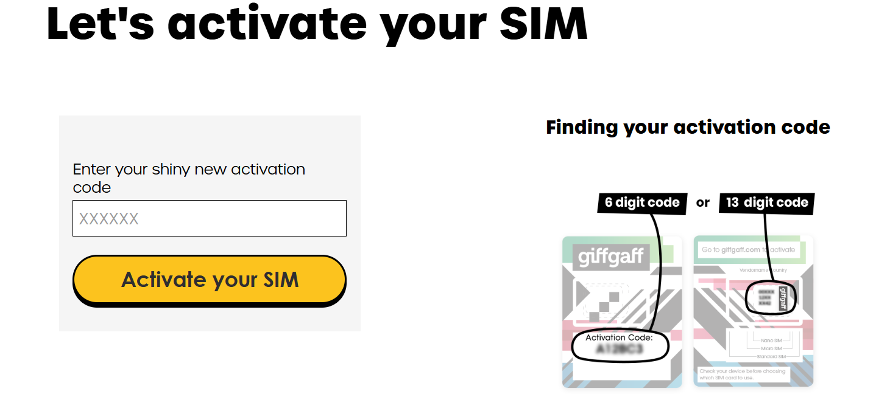

## Giff gaff电话卡

##### +86手机号国内还好 而到了国外.....

寸步难行

于是萌生出了搞一张境外卡的念头

接着 Giff gaff 便出现在我的视野里

优点是

##### 不记名 便宜 免费收短信 保号简单

#### 申请方式

访问官网 填上地址啥的 然后

等.........................

经过跋山涉水的半个月 你的Sim卡便会来和你会面

#### 使用方法

打开那一张纸叠成的“信封” 看到一张小卡 把上面的激活码输到 giffgaff 官网

接着 选择套餐 上面的一堆套餐一律不管 只选pay as you  go 冲10欧即可（ps:付不了款的可以淘宝买礼品卡）

之后一步步激活 把卡插到手机里就好了（有些牌子手机每次插卡都会自动发一条短信扣费 记得提前关了）

### 保号

我们得到这张卡 最主要就是可以收短信 其他死贵的功能不必理会

最重要的是 当你的卡180天没有余额变动时 就会冻结 所以 为了保号 没180天发一次短信（0.3欧元）

还有更便宜的方法 把流量打开几秒马上关掉之类的 自行折腾

#### 结语

这张卡性价比极高 没有强制套餐限制 接收短信免费 

所以是一张极好软件注册神卡 不会受任何限制 同时作为实体卡 也不会像Google voice那种虚拟号的限制

